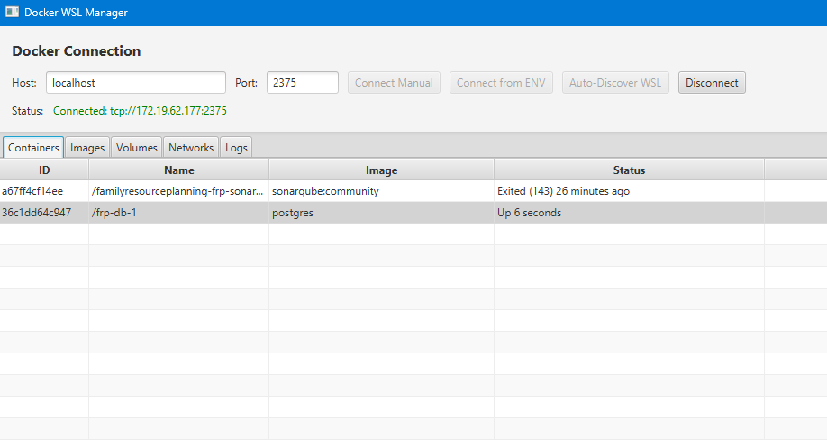
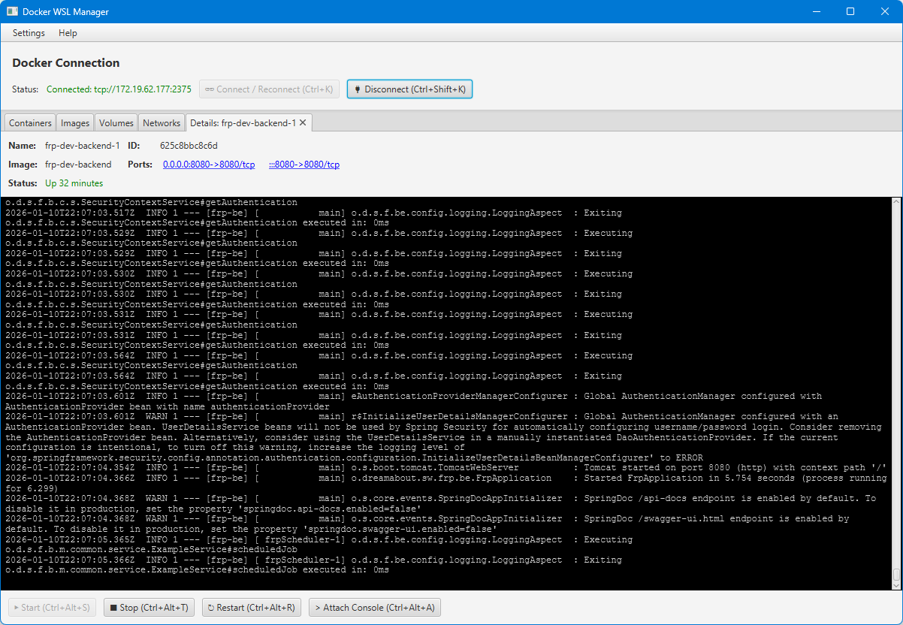

# docker-wsl-manager

Lightweight standalone JavaFX application for managing Docker running in WSL 2, connecting via TCP/IP.




## Features

- **Connection Methods**:
  - Auto-discovery of Docker in WSL using `wsl` command

- **Container Management**:
  - List all containers (running and stopped)
  - Start, stop, restart containers
  - Remove containers
  - **Open Details**: View container logs in real-time (with ANSI color support) and control the container from a dedicated tab
  - Attach to container console (basic support)
  - Clickable port links for running containers

- **Settings & Customization**:
  - **Configurable Shortcuts**: Customize keyboard shortcuts for all major actions via the Settings menu
  - **Auto-Refresh**: Toggle and configure the interval for automatic container list refreshing
  - **Auto-Update**: Automatically checks for new releases on startup

- **Image Management**:
  - List all Docker images
  - Pull new images from Docker Hub
  - Remove images

- **Volume Management**:
  - List all volumes
  - Remove volumes

- **Network Management**:
  - List all networks
  - Remove networks

## Requirements

- **Runtime**: Java 21 or higher
- **Build**: Maven 3.6 or higher
- **MSI Build**: JDK 25 and [WiX Toolset v7+](https://wixtoolset.org/)
- **Environment**: Docker running in WSL 2 (for Windows users)
- **Configuration**: Docker daemon exposed on TCP port (typically 2375)

## Building

### Standard Build
```bash
mvn clean package
```
Creates a shaded JAR in `target/`.

### Standalone Release (Optimized)
```bash
mvn clean package -P release
```
Creates `docker-wsl-manager-[version]-standalone.jar` with optimized manifest and merged service files.

### Windows MSI Installer
Requires JDK 25 and WiX 7. One-time WiX 7 EULA acceptance is required: `wix eula accept wix7`.

Execute the following in PowerShell (adjust paths as necessary):
```powershell
$env:JAVA_HOME = "C:\dev\Java\jdk-25.0.1-full"
$env:PATH = "$env:JAVA_HOME\bin;" + $env:PATH + ";C:\Program Files\WiX Toolset v7.0\bin"
mvn package -P msi -DskipTests
```

## Running

### Using the Standalone JAR
```bash
java -jar target/docker-wsl-manager-<version>-standalone.jar
```

## Developer Guide

### Preparing a New Release
The complete release checklist is in [RELEASE_BUILD.md](RELEASE_BUILD.md). In brief:

1. Update the version in `pom.xml` and write version-specific release notes.
2. Build the verified standalone package:

   ```powershell
   .\build-release.ps1 -ReleaseNotesPath ".\path\to\release-notes.md"
   ```
   The script reads the version from `pom.xml`, runs tests, and writes all artifacts to the ignored `release-output/` directory.
3. Build an MSI when required, using JDK 25 and WiX 7:

   ```powershell
   .\build-release.ps1 -ReleaseNotesPath ".\path\to\release-notes.md" -BuildMsi
   ```
4. Verify the artifacts, create and push tag `v<version>`, then create the GitHub Release and upload the ZIP and MSI.

## Project Structure

```
docker-wsl-manager/
├── src/
│   ├── main/
│   │   ├── java/
│   │   │   └── org/dreamabout/sw/dockerwslmanager/
│   │   │       ├── Main.java                     # Application entry point
│   │   │       ├── MainController.java           # Main UI controller
│   │   │       └── DockerConnectionManager.java  # Docker connection handler
│   │   └── resources/
│   │       ├── main.fxml                         # JavaFX layout
│   │       └── shortcuts.properties              # Keyboard shortcuts
│   └── test/
├── conductor/                                    # Project documentation & tracks (Conductor)
├── release-output/                                # Ignored release artifacts created by build-release.ps1
├── pom.xml                                       # Maven configuration
└── README.md                                     # This file
```

## License

This project is licensed under the MIT License - see the [LICENSE](LICENSE) file for details.

## Contributing

Contributions are welcome! Please feel free to submit a Pull Request.

### AI Agent Support
This project provides repository instructions for Codex in [AGENTS.md](AGENTS.md).
